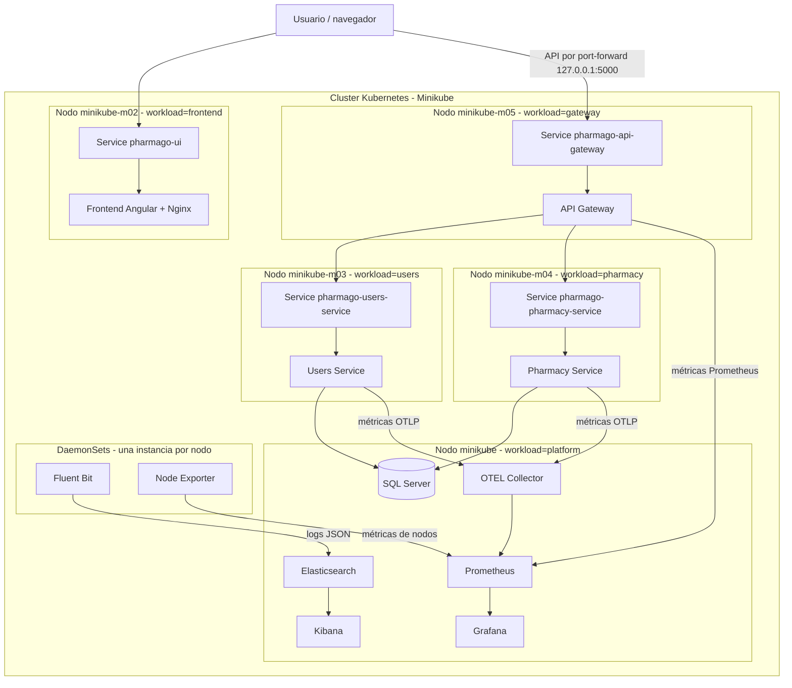

# Bosquejo del diagrama de despliegue

El siguiente diagrama representa la distribución de la plataforma en Minikube.



## Evidencia esperada

```text
pharmago-ui                  -> minikube-m02
pharmago-users-service       -> minikube-m03
pharmago-pharmacy-service    -> minikube-m04
pharmago-api-gateway         -> minikube-m05
pharmago-db                  -> minikube
elasticsearch/prometheus/... -> minikube
fluent-bit/node-exporter     -> todos los nodos
```

El frontend es una aplicación estática: las llamadas HTTP al API se originan en
el navegador. Por eso el frontend y el API Gateway pueden estar en nodos
distintos sin requerir comunicación directa entre el contenedor Nginx y el
Gateway.
